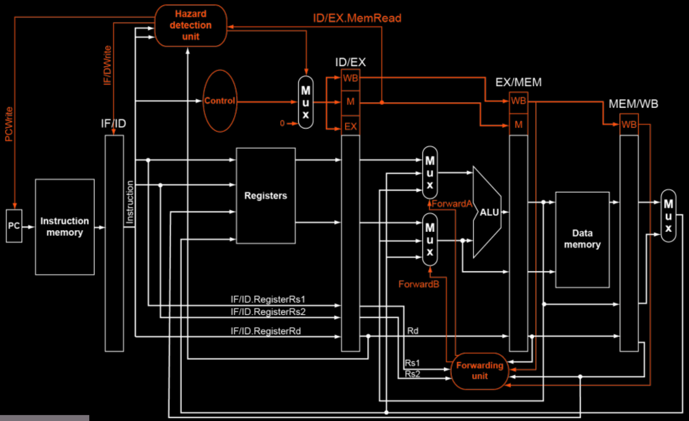

# Pipelined RISC-V Processor

## Overview

This folder contains the pipelined implementation of a RISC-V processor. The design improves performance by executing multiple instructions simultaneously in different pipeline stages.

## Features

- **5-Stage Pipeline**: Instruction Fetch (IF), Instruction Decode (ID), Execute (EX), Memory Access (MEM), Write Back (WB)
- **Hazard Handling**:
  - Data forwarding to minimize stalls
  - Basic stall detection for load-use hazards
  - Handles control hazards using flushing methods
- **Supports RISC-V Instructions** (Arithmetic, Load/Store, Branch, Logical)
- **Implemented in Verilog with testbenches**

## File Structure

```
pipelining/
│── alu.v, alu_control.v        # ALU and ALU control unit
│── control_unit.v              # Control signals for instruction execution
│── data.v                      # Memory unit for storing data
│── fwding_unit.v               # Forwarding unit for hazard mitigation
│── hazard_detection_unit.v     # Hazard detection logic
│── pipeline registers (ifid, idex, exmem, memwb)
│── instruction.v               # Instruction decoding module
│── mux.v                       # Multiplexers used in the design
│── register.v                  # Register file
│── main.v                      # Top-level processor design
│── main_test.v                 # Testbench for simulation
│── Assembly & Test Files:
│   ├── assem0.txt, assem1.txt  # Assembly code with dry runs in comments
│   ├── data0.txt, data1.txt    # Memory data contents
│   ├── ins0.txt, ins1.txt      # 32-bit binary instructions
│── Output Files:
│   ├── output/                 # Simulation results
│   ├── output.vcd              # Waveform data for GTKWave
│   ├── output_waveform.gtkw    # Preconfigured GTKWave settings
│── README.md                   # This documentation
```

## Running the Simulation

1. **Compile the Verilog Code**
   ```sh
   iverilog -o output main_test.v
   ```
2. **Dump the vcd File**
   ```sh
   vvp output
   ```
3. **View Waveforms in GTKWave**
   ```sh
   gtkwave output.vcd
   ```
## Pipeline Diagram



## Testing

- Assembly programs (`assem0.txt`, `assem1.txt`) include dry-run comments.
- Memory contents are stored in `data0.txt` and `data1.txt`.
- Instruction binaries are stored in `ins0.txt` and `ins1.txt`.
- Modify these files to test different scenarios and performance under hazards.

## Notes

The pipelined processor enhances execution speed compared to the sequential version but requires careful handling of hazards and forwarding mechanisms for efficiency.
