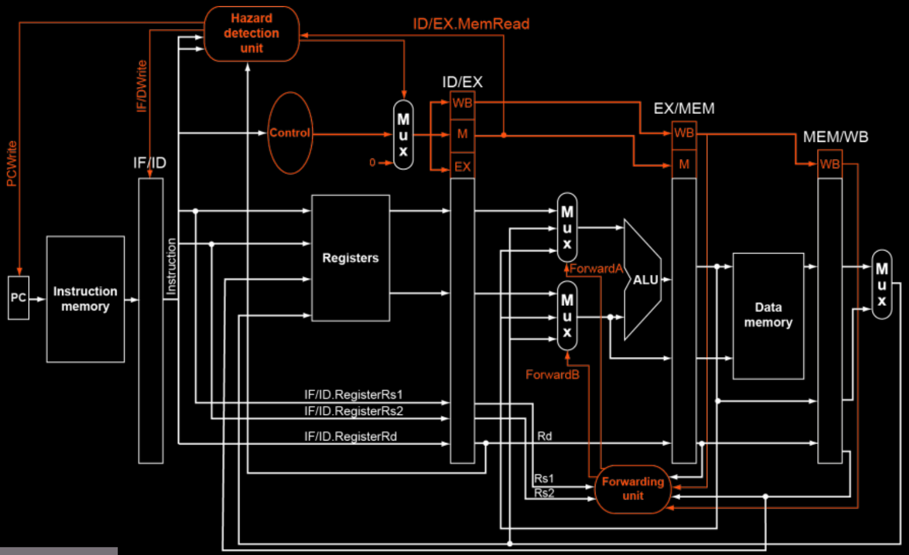

# pipelined risc-v processor

## overview

this folder contains the pipelined implementation of a risc-v processor. the design improves performance by executing multiple instructions simultaneously in different pipeline stages.

## features

- **5-stage pipeline**: instruction fetch (if), instruction decode (id), execute (ex), memory access (mem), write back (wb)
- **hazard handling**:
  - data forwarding to minimize stalls
  - basic stall detection for load-use hazards
  - handles control hazards using flushing methods
- **supports risc-v instructions** (arithmetic, load/store, branch, logical)
- **implemented in verilog with testbenches**

## file structure

```
pipelining/
│── alu.v, alu-control.v        # alu and alu control unit
│── control-unit.v              # control signals for instruction execution
│── data.v                      # memory unit for storing data
│── fwding-unit.v               # forwarding unit for hazard mitigation
│── hazard-detection-unit.v     # hazard detection logic
│── pipeline registers (ifid, idex, exmem, memwb)
│── instruction.v               # instruction decoding module
│── mux.v                       # multiplexers used in the design
│── register.v                  # register file
│── main.v                      # top-level processor design
│── main-test.v                 # testbench for simulation
│── assembly-and-test-files:
│   ├── assem0.txt, assem1.txt  # assembly code with dry runs in comments
│   ├── data0.txt, data1.txt    # memory data contents
│   ├── ins0.txt, ins1.txt      # 32-bit binary instructions
│── output-files:
│   ├── output/                 # simulation results
│   ├── output.vcd              # waveform data for gtkwave
│   ├── output-waveform.gtkw    # preconfigured gtkwave settings
│── README.md                   # this documentation
```

## running the simulation

1. **compile the verilog code**
   ```sh
   iverilog -o output main_test.v
   ```
2. **dump the vcd file**
   ```sh
   vvp output
   ```
3. **view waveforms in gtkwave**
   ```sh
   gtkwave output.vcd
   ```
## pipeline diagram



## testing

- assembly programs (`assem0.txt`, `assem1.txt`) include dry-run comments.
- memory contents are stored in `data0.txt` and `data1.txt`.
- instruction binaries are stored in `ins0.txt` and `ins1.txt`.
- modify these files to test different scenarios and performance under hazards.

## notes

the pipelined processor enhances execution speed compared to the sequential version but requires careful handling of hazards and forwarding mechanisms for efficiency.
