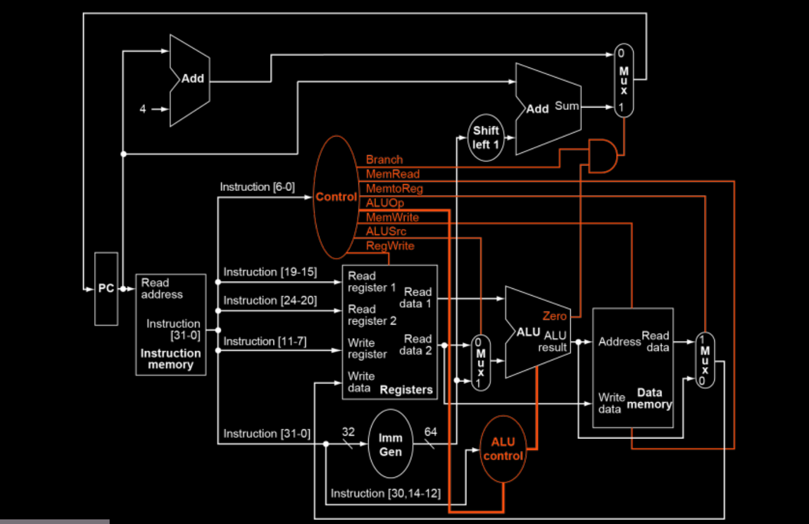

# sequential risc-v processor

## overview

this folder contains the sequential implementation of a risc-v processor. unlike the pipelined version, this design processes instructions one at a time, making it simpler but less efficient in terms of execution speed.

## features

- **single-cycle execution**: each instruction completes in one cycle.
- **basic risc-v instruction set**: supports arithmetic, logical, load/store, and branch instructions.
- **no hazard handling**: snstructions execute sequentially without forwarding or stalling mechanisms.
- **implemented in verilog with testbenches**

## repository structure

```
sequential/
│── alu.v, alu-control.v        # alu and alu control unit
│── control-unit.v              # control signals for instruction execution
│── data-mem.v                  # memory unit for storing data
│── instruction.v               # instruction decoding module
│── mux-2x1.v                   # multiplexers used in the design
│── pc.v                        # program counter
│── register.v                  # register file
│── main.v                      # top-level processor design
│── main-test.v                 # testbench for simulation
│── assembly-and-test-files:
│   ├── assem0.txt, assem1.txt  # assembly code with dry runs in comments
│   ├── data0.txt, data1.txt    # memory data contents
│   ├── ins0.txt, ins1.txt      # 32-bit binary instructions
│── output-files:
│   ├── output/                 # simulation results
│   ├── output.vcd              # waveform data for gtkwave
│   ├── output-waveform.gtkw    # preconfigured gtkwave settings
│── README.md                   # this documentation
```

## running the simulation

1. **compile the verilog code**
   ```sh
   iverilog -o output main_test.v
   ```
2. **dump the vcd file**
   ```sh
   vvp output
   ```
3. **view waveforms in gtkwave**
   ```sh
   gtkwave output_waveform.vcd
   ```

## sequential diagram



## testing

- assembly programs (`assem0.txt`, `assem1.txt`) include dry-run comments.
- memory contents are stored in `data0.txt` and `data1.txt`.
- instruction binaries are stored in `ins0.txt` and `ins1.txt`.
- modify these files to test different instructions and execution scenarios.

## notes

this sequential processor serves as a baseline for understanding risc-v architecture before moving to more advanced pipelined implementations.
